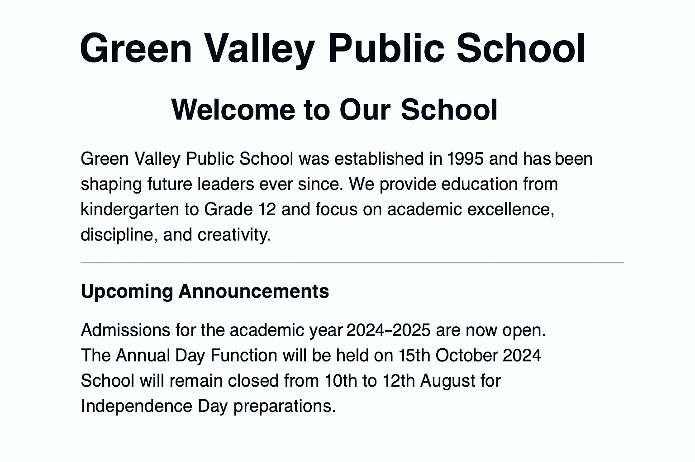

# 📘 HTML Basics: Structure, Headings, Paragraphs, and Line Breaks

## 🎯 Learning Goals
- *Understand the structure of an HTML document*
- *Use basic tags like `<!DOCTYPE>`, `<html>`, `<head>`, `<body>`, `<h1>`–`<h6>`, `
`, ` `, `
`*
- *Open the HTML file in a browser*

## 📚 Learning Objectives
- Understand the basic structure of an HTML page
- Use heading tags (`<h1>` to `<h6>`)
- Use paragraph (`
`), line break (` `), and horizontal line (`
`)
- Learn how to open `.html` files in a browser

---

## ✅ Step-by-Step Tasks

1. **Create a folder** named `day1-school-homepage`.
2. Inside the folder, **create a file** named `index.html`.
3. Open `index.html` in a text editor and complete the following steps:
4. Add the standard HTML document declaration with `<html>` tag.
5. Create the base HTML structure using `<html>`, `<head>`, and `<body>` tags.
6. Inside the `<head>` tag, add the following:
    - A `<meta charset="UTF-8">` tag  
    - A `<title>` tag with the text:  
      **Green Valley Public School**
7. In the `<body>` section, add the following content in this exact structure:
8. Add an `<h1>` tag with this text:  
   **Green Valley Public School**
9. Add an `<h2>` heading:  
   **Welcome to Our School**

10. Below it, add a paragraph (`
`) with the following content:

> Green Valley Public School was established in 1995 and has been shaping future leaders ever since.  
> We provide education from kindergarten to Grade 12 and focus on academic excellence, discipline, and creativity.

11. Insert an `
` tag to separate this section.

12. Add an `<h3>` heading:  
    **Upcoming Announcements**

13. Add a paragraph below it with the following content:

> Admissions for the academic year 2024–2025 are now open.  
> The Annual Day Function will be held on 15th October 2024.  
> School will remain closed from 10th to 12th August for Independence Day preparations.

---

