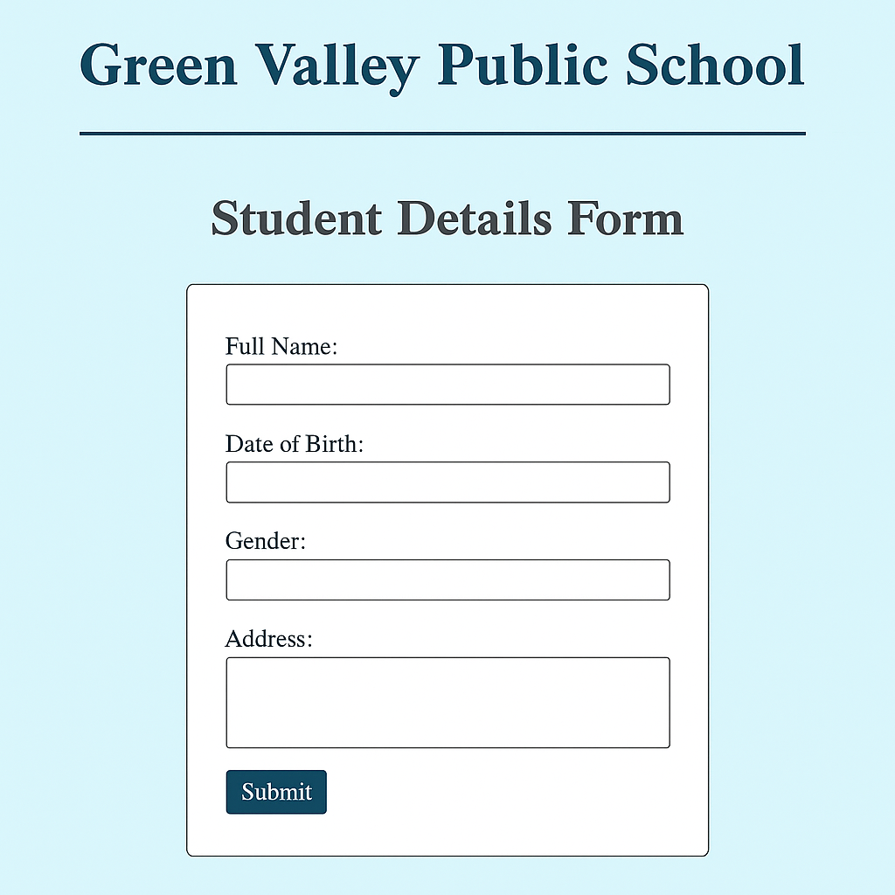

# 📘 Responsive Design: Media Queries

## 📚 Learning Objectives
- Learn how to use **media queries** in CSS
- Make layouts adapt to different screen sizes (mobile, tablet, desktop)
- Adjust fonts, layout direction, and element sizes based on viewport width
- Build a truly **responsive school homepage**

---

## ✅ Step-by-Step Tasks

1. **Create a new folder** named `day10-school-homepage`.
2. Inside the folder, create:
   - `index.html`
   - `style.css`
3. Build a complete HTML page structure.
4. In the `<head>`, include:
   - `<meta charset="UTF-8">`
   - `<meta name="viewport" content="width=device-width, initial-scale=1.0">`
   - `<title>`:  
     **Green Valley Public School – Day 10**
   - Link the stylesheet with:  
     `<link rel="stylesheet" href="style.css">`

---

### 🔹 HTML Body Content

5. Add a `<header>` with `<h1>`:  
   **Green Valley Public School**

6. Add a section with class `"info-block"` containing:
   - Two divs:
     - `<div class="mission">`
       - `<h2>`: Our Mission
       - `<p>`: To nurture responsible citizens and empower lifelong learners.
     - `<div class="vision">`
       - `<h2>`: Our Vision
       - `<p>`: To be a center of academic excellence and innovation.

---

### 🔹 CSS Styling (`style.css`)

7. Base styles:
   - `body`: background color `#eef2f3`, font-family `Arial, sans-serif`, padding `20px`
   - `h1`: centered, color `#004080`
   - `.info-block`: `display: flex`, `gap: 20px`, `justify-content: center`

8. Style each box (`.mission`, `.vision`):
   - Background: white
   - Padding: 20px
   - Border: 1px solid #ccc
   - Width: 45%
   - Box shadow for effect

---

### 🔹 Media Query for Responsiveness

9. At the end of your `style.css`, add:

```css
@media (max-width: 768px) {
  .info-block {
    flex-direction: column;
    align-items: center;
  }
  .mission, .vision {
    width: 90%;
  }
}
```

---

## ✅ Final Checklist for Students

- [ ] Folder is named `day10-school-homepage`
- [ ] Layout shows two side-by-side boxes on desktop
- [ ] Boxes stack vertically on smaller screens
- [ ] Uses media query to change layout at max-width 768px
- [ ] Page is responsive and readable on mobile

---

### 🖼️ Preview Output

*Add this image as `chapter10.png` in `../images/`:*


