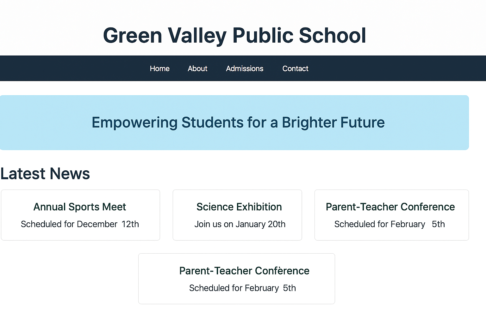

# 📘 CSS Transitions and Basic Animations

## 📚 Learning Objectives
- Add smooth visual effects using `transition`
- Create interactive hover states
- Build simple animations using `@keyframes`
- Learn how to animate buttons, banners, or boxes

---

## ✅ Step-by-Step Tasks

1. **Create a new folder** named `day11-school-homepage`.
2. Inside the folder, create:
   - `index.html`
   - `style.css`
3. Set up a full HTML document structure in `index.html`.
4. In the `<head>`, include:
   - `<meta charset="UTF-8">`
   - `<title>`:  
     **Green Valley Public School – Day 11**
   - `<link rel="stylesheet" href="style.css">`

---

### 🔹 HTML Body Structure

5. Add a `<header>` with `<h1>`:  
   **Green Valley Public School**

6. Create a `<div class="animated-banner">` with the text:  
   *Welcome to Our Dynamic School Website*

7. Add two `<button>` elements:
   - One with text: **Apply Now**
   - Another with text: **View Courses**

---

### 🔹 CSS Styling (`style.css`)

8. General Styling:
   - `body`: `font-family: Arial`, `background: #f2f4f7`, `text-align: center`, `padding: 40px`

9. `.animated-banner`:
   - Background color: `#cce6ff`
   - Padding: `20px`
   - Animation: `slidein 3s ease-in-out infinite alternate`

10. Buttons:
   - Padding: `10px 20px`
   - Border: none
   - Background color: `#004080`
   - Text color: white
   - Cursor: pointer
   - Margin: `10px`
   - Add `transition: background-color 0.3s ease`

11. Button hover state:
   - On `:hover`, change background to `#007acc`

---

### 🔹 Add Animation

12. At the bottom of `style.css`, add this animation:

```css
@keyframes slidein {
  from {
    transform: translateX(-20px);
    opacity: 0.6;
  }
  to {
    transform: translateX(20px);
    opacity: 1;
  }
}
```

---

## ✅ Final Checklist for Students

- [ ] Folder is named `day11-school-homepage`
- [ ] Page has a moving banner using `@keyframes`
- [ ] Two buttons change color on hover using `transition`
- [ ] Uses proper class naming and structure
- [ ] Page feels dynamic and interactive

---

### 🖼️ Preview Output

*Add this image as `chapter11.png` in `../images/`:*


