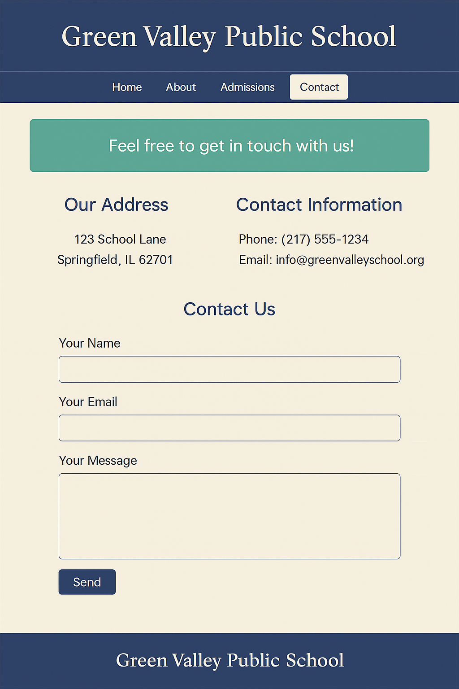

# 📘 Final Project: Full Homepage Using All Learned Concepts

## 📚 Learning Objectives
- Combine all previous concepts into a single project
- Use semantic HTML structure
- Apply CSS Grid or Flexbox for layout
- Implement reusable CSS via variables and organized styling
- Ensure mobile responsiveness

---

## ✅ Step-by-Step Tasks

1. **Create a new folder** named `day14-school-homepage`.
2. Inside the folder, create:
   - `index.html`
   - `style.css`

---

### 🔹 HTML Structure

3. Create a complete HTML page with the following structure:
   - `<header>` with `<h1>`: Green Valley Public School
   - `<nav>` with 4 links: Home, About, Facilities, Contact
   - `<main>` section containing:
     - A welcome section with intro text
     - A features section (grid of 3 boxes: Library, Labs, Sports)
     - A principal message section
     - A notice board with 2–3 items
   - `<footer>` with © notice

4. Use semantic tags: `<header>`, `<nav>`, `<main>`, `<section>`, `<footer>`

---

### 🔹 CSS Styling

5. Use `:root` variables for:
   - Background color
   - Primary text color
   - Accent color
   - Padding

6. Use Flexbox or Grid to:
   - Create a horizontal nav bar
   - Layout the 3 feature boxes
   - Organize content in 2-column layout on desktop, 1-column on mobile

7. Use media queries to make the layout responsive.

8. Add transitions on nav links or buttons.

9. Use pseudo-elements for icons or decorations.

10. Apply at least one animation using `@keyframes`.

---

## ✅ Final Checklist for Students

- [ ] Folder is named `day14-school-homepage`
- [ ] Uses proper semantic structure
- [ ] Includes navigation and main content
- [ ] Layout adjusts on small screens
- [ ] Styled with variables, transitions, and animations
- [ ] Includes at least one hover effect and one `::before` or `::after`

---

### 🖼️ Preview Output

*Add this image as `chapter14.png` in `../images/`:*

