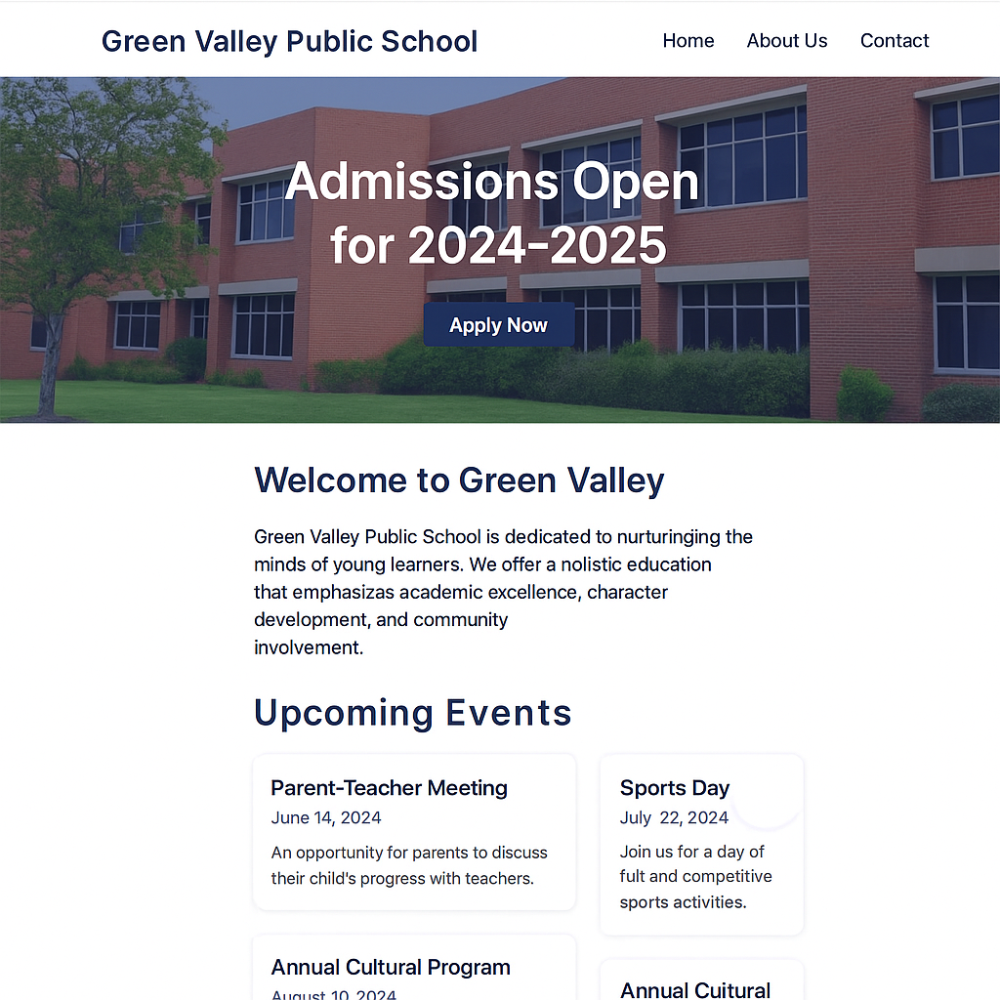

# 📘 Final Touches and Polishing the School Website

## 📚 Learning Objectives
- Review and refine the full website structure
- Ensure all HTML and CSS code is valid and clean
- Make the website responsive and visually appealing
- Prepare the project for final submission or presentation

---

## ✅ Step-by-Step Tasks

1. **Create a new folder** named `day15-school-homepage`.
2. Copy your final project files (`index.html` and `style.css`) from Day 14 into this folder.
3. Open the HTML and CSS files and go through each of the following:

---

### 🔹 Cleanup & Validation

4. Remove any unused CSS rules or HTML elements.
5. Ensure:
   - Proper indentation and spacing
   - Consistent naming of classes and IDs
   - HTML is properly nested and closed

6. Run your HTML through the W3C validator (https://validator.w3.org/) and fix any errors or warnings.

---

### 🔹 Accessibility & Meta Tags

7. Add or verify the following:
   - `<meta name="viewport" content="width=device-width, initial-scale=1.0">`
   - `<meta name="description" content="Green Valley Public School official homepage">`
   - Use `alt` attributes on all `` tags

---

### 🔹 Responsive Testing

8. Test your page on:
   - Mobile screen (320px)
   - Tablet (768px)
   - Desktop (1024px+)

Ensure:
   - Navigation adjusts properly
   - Text is readable on all screen sizes
   - Images and boxes stack cleanly

---

### 🔹 Visual Polish

9. Review the use of:
   - Colors (should be consistent)
   - Fonts and font sizes
   - Padding and spacing
   - Hover and active states for links or buttons

10. Make any design improvements to give your website a professional and finished look.

---

## ✅ Final Checklist for Students

- [ ] Folder is named `day15-school-homepage`
- [ ] Website looks clean and professional
- [ ] Validated through W3C with no critical errors
- [ ] Fully responsive and mobile-friendly
- [ ] Organized, commented, and readable code

---

### 🖼️ Preview Output

*Add this image as `chapter15.png` in `../images/`:*

