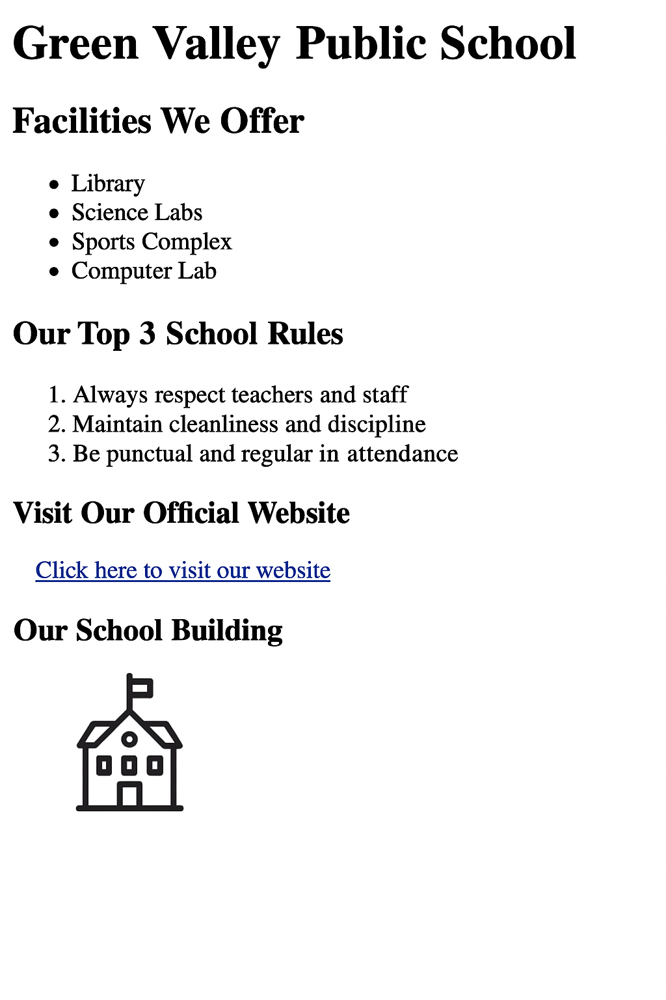

# 📘 HTML Fundamentals: Lists, Links, and Images

## 📚 Learning Objectives
- Use **unordered** and **ordered** lists
- Add **hyperlinks** to external websites
- Insert **images** into a webpage
- Understand common attributes like `href`, `src`, `alt`, and `width`
- *Use HTML tags like `<ul>`, `<ol>`, `<li>`, `<a>`, and ``*

---

## ✅ Step-by-Step Tasks

1. **Create a new folder** named `day2-school-homepage`.
2. Inside the folder, **create a file** named `index.html`.
3. Open `index.html` in a text editor and complete the following tasks:
4. Add the standard HTML document declaration and build the base structure using `<html>`, `<head>`, and `<body>` tags.
5. Inside the `<head>` tag, add:
    - `<meta charset="UTF-8">`  
    - `<title>` tag with this text:  
      **Green Valley Public School – Day 2**
6. In the `<body>` section, add an `<h1>` heading with the text:  
   **Green Valley Public School**
7. Add an `<h2>` heading with the text:  
   **Facilities We Offer**
8. Below it, create an **unordered list** with the following items:
    - Library  
    - Science Labs  
    - Sports Complex  
    - Computer Lab
9. Add another `<h2>` heading with the text:  
   **Our Top 3 School Rules**
10. Below it, create an **ordered list** with these items:
    - Always respect teachers and staff  
    - Maintain cleanliness and discipline  
    - Be punctual and regular in attendance
11. Add an `<h3>` heading with the text:  
    **Visit Our Official Website**
12. Below it, add a clickable hyperlink:  
    - Link Text: **Click here to visit our website**  
    - Link URL: `https://www.greenvalleyschool.edu.in`
13. Add another `<h3>` heading with the text:  
    **Our School Building**
14. Add an image using the `` tag with these properties:
    - `src`: `https://upload.wikimedia.org/wikipedia/commons/thumb/a/a1/School_building_icon.svg/1024px-School_building_icon.svg.png`  
    - `alt`: Green Valley School Building  
    - `width`: 300

---

## ✅ Final Checklist for Students

- [ ] File is named `index.html` inside `day2-school-homepage`
- [ ] Page opens in a browser without error
- [ ] Includes unordered list with 4 items
- [ ] Includes ordered list with 3 items
- [ ] Hyperlink correctly links to external URL
- [ ] Image is visible, has correct width and alt text
- [ ] Uses proper heading tags

---

### 🖼️ Preview Output

*Add this image as `chapter02.png` in `../images/`:*

