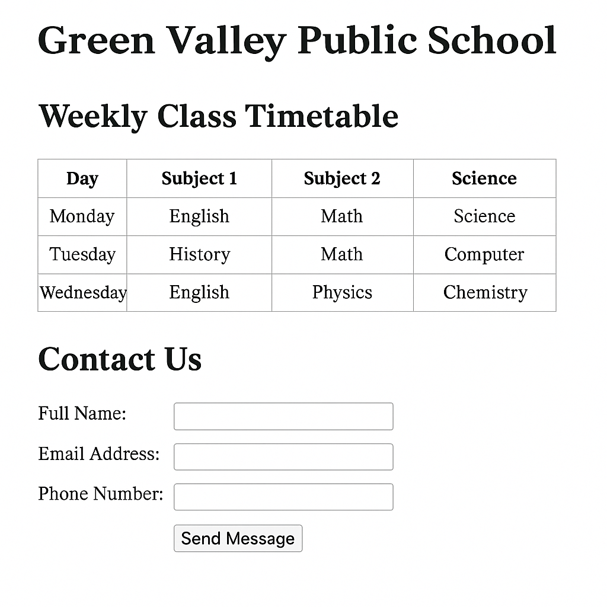

# 📘 HTML Fundamentals: Tables and Forms

## 📚 Learning Objectives
- Learn how to create **tables** to organize data
- Learn how to create a basic **form**
- Understand key tags and attributes like `table`, `tr`, `th`, `td`, `form`, `input`, `label`, and `button`
- *Use HTML tags like `<table>`, `<thead>`, `<tbody>`, `<tr>`, `<th>`, `<td>`, `<form>`, `<label>`, `<input>`, and `<button>`*

---

## ✅ Step-by-Step Tasks

1. **Create a new folder** named `day3-school-homepage`.
2. Inside the folder, **create a file** named `index.html`.
3. Open `index.html` in a text editor and complete the following tasks:
4. Add the standard HTML document declaration and build the base structure using `<html>`, `<head>`, and `<body>` tags.
5. Inside the `<head>` tag, add:
    - `<meta charset="UTF-8">`  
    - `<title>` tag with this text:  
      **Green Valley Public School – Day 3**

---

### 🔹 Table Section – Weekly Timetable

6. Add an `<h1>` heading with this text:  
   **Green Valley Public School**

7. Add an `<h2>` heading:  
   **Weekly Class Timetable**

8. Below it, create a table with:
    - A header row (`<th>`) with the columns: **Day**, **Subject 1**, **Subject 2**, **Subject 3**
    - Three data rows with the following content:

| Day    | Subject 1 | Subject 2 | Subject 3     |
|--------|-----------|-----------|----------------|
| Monday | English   | Math      | Science        |
| Tuesday| History   | Math      | Computer       |
| Wednesday | English | Physics  | Chemistry      |

9. Use `<thead>` for the header row and `<tbody>` for the content rows.

---

### 🔹 Form Section – Contact Us

10. Add an `<h2>` heading with this text:  
    **Contact Us**

11. Below it, create a form with the following fields:
    - A label and input for **Full Name**
    - A label and input for **Email Address**
    - A label and input for **Phone Number**
    - A submit button labeled **Send Message**

12. Use appropriate `type` attributes (`text`, `email`, `tel`, `submit`) for the inputs.

13. Group each input with its label using `<label>` tags and line breaks (` `) to keep the form readable.

---

## ✅ Final Checklist for Students

- [ ] File is named `index.html` inside `day3-school-homepage`
- [ ] Page opens in a browser without error
- [ ] Table contains 1 header row and 3 data rows
- [ ] Table uses `<thead>` and `<tbody>` sections
- [ ] Form contains 3 input fields with labels and a submit button
- [ ] Labels are properly associated with their inputs

---

### 🖼️ Preview Output

*Add this image as `chapter03.png` in `../images/`:*

