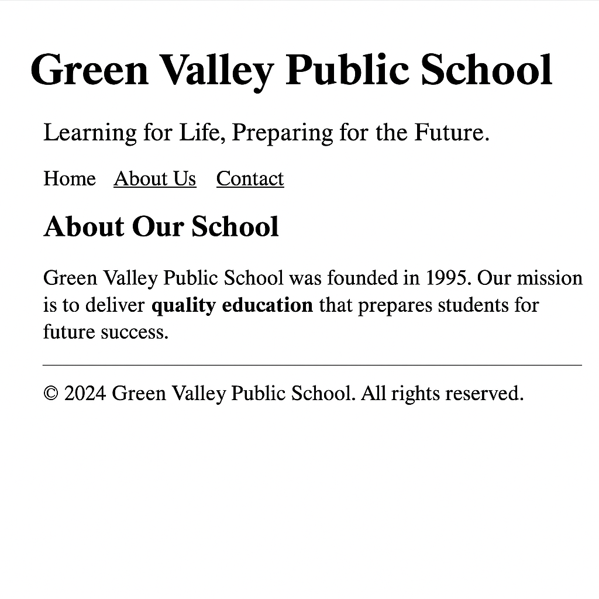

# 📘 HTML Fundamentals: Layout Tags, Nesting, and Comments

## 📚 Learning Objectives
- Learn how to use layout tags like `
`, ``, and semantic tags (`<header>`, `<nav>`, `<section>`, `<footer>`)
- Practice **nesting HTML elements correctly**
- Use **HTML comments** to document structure
- Organize HTML for maintainability and readability

---

## ✅ Step-by-Step Tasks

1. **Create a new folder** named `day4-school-homepage`.
2. Inside the folder, **create a file** named `index.html`.
3. Open `index.html` in a text editor and complete the following tasks:
4. Add the standard HTML document declaration and build the base structure using `<html>`, `<head>`, and `<body>` tags.
5. Inside the `<head>` tag, add:
   - `<meta charset="UTF-8">`  
   - `<title>` tag with this text:  
     **Green Valley Public School – Day 4**

---

### 🔹 Using Layout & Semantic Tags

6. Add an HTML comment above each major section to describe it.

7. Create a `<header>` element with the following inside:
   - `<h1>` tag with the text:  
     **Green Valley Public School**
   - `
` tag with the text:  
     *"Learning for Life, Preparing for the Future."*

8. Create a `<nav>` element with the following:
   - A list of links (unordered list with 3 items):
     - Home (`#`)
     - About Us (`#`)
     - Contact (`#`)

9. Create a `<section>` element with the heading:  
   **About Our School**

10. Inside that `<section>`, place a `
` that contains:
   - A paragraph with the following text:  
     *Green Valley Public School was founded in 1995. Our mission is to deliver quality education that prepares students for future success.*

   - A nested `` inside the paragraph to highlight the word: **"quality education"** using a `<strong>` tag.

---

### 🔹 Adding a Footer

11. At the bottom of the page, add a `<footer>` element with the following content:
   - A line that says:  
     *© 2024 Green Valley Public School. All rights reserved.*

---

## ✅ Final Checklist for Students

- [ ] File is named `index.html` inside `day4-school-homepage`
- [ ] Uses semantic tags: `<header>`, `<nav>`, `<section>`, `<footer>`
- [ ] Contains at least one `
` and one `` tag
- [ ] Uses one `<strong>` tag inside the ``
- [ ] Includes 3 `<a>` tags inside a list inside `<nav>`
- [ ] Includes at least 2 HTML comments explaining structure
- [ ] Page opens correctly in browser

---

### 🖼️ Preview Output

*Add this image as `chapter04.png` in `../images/`:*

