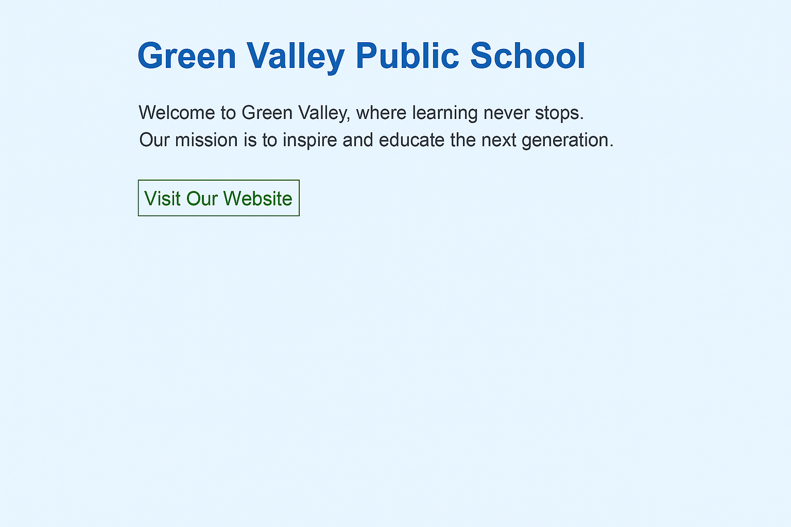

# 📘 CSS Basics: Linking, Selectors, and Basic Styling

## 📚 Learning Objectives
- Learn how to **link a CSS file** to an HTML file
- Use **CSS selectors** to style HTML elements
- Style elements like headings, paragraphs, and links
- Understand basic CSS properties like `color`, `background-color`, `font-size`, `text-align`, `border`

---

## ✅ Step-by-Step Tasks

1. **Create a new folder** named `day5-school-homepage`.
2. Inside the folder, **create two files**:
   - `index.html`
   - `style.css`
3. Open `index.html` in a text editor and follow these tasks:
4. Create a complete HTML document with standard structure.
5. Inside the `<head>` tag:
   - Add `<meta charset="UTF-8">`
   - Set `<title>` as:  
     **Green Valley Public School – Day 5**
   - Link the CSS file using the `<link>` tag:  
     `href="style.css"` and `rel="stylesheet"`

---

### 🔹 HTML Body Content

6. Add an `<h1>` heading with the text:  
   **Green Valley Public School**

7. Add a paragraph with this text:  
   *Welcome to Green Valley, where learning never stops. Our mission is to inspire and educate the next generation.*

8. Add a link with this text:  
   **Visit Our Website**  
   URL: `https://www.greenvalleyschool.edu.in`

---

### 🔹 Create `style.css` and Add the Following Styles

9. In `style.css`, write CSS to apply the following:

- Set the `body` background color to `#f0f8ff`
- Set `font-family` to `Arial, sans-serif`
- For the `<h1>` tag:
  - Set `color: darkblue`
  - Align text to the center
- For `
` tags:
  - Set `font-size: 16px`
  - Set `color: #333`
- For `<a>` tags:
  - Set link color to `green`
  - Remove underline using `text-decoration: none`
  - Add `border: 1px solid green` and `padding: 5px`

---

## ✅ Final Checklist for Students

- [ ] `index.html` and `style.css` are in `day5-school-homepage` folder
- [ ] CSS file is correctly linked in the `<head>`
- [ ] HTML contains a heading, paragraph, and a link
- [ ] CSS styles are applied to `body`, `h1`, `p`, and `a` tags
- [ ] Page renders with styling in browser (background color, fonts, link border, etc.)

---

### 🖼️ Preview Output

*Add this image as `chapter05.png` in `../images/`:*

