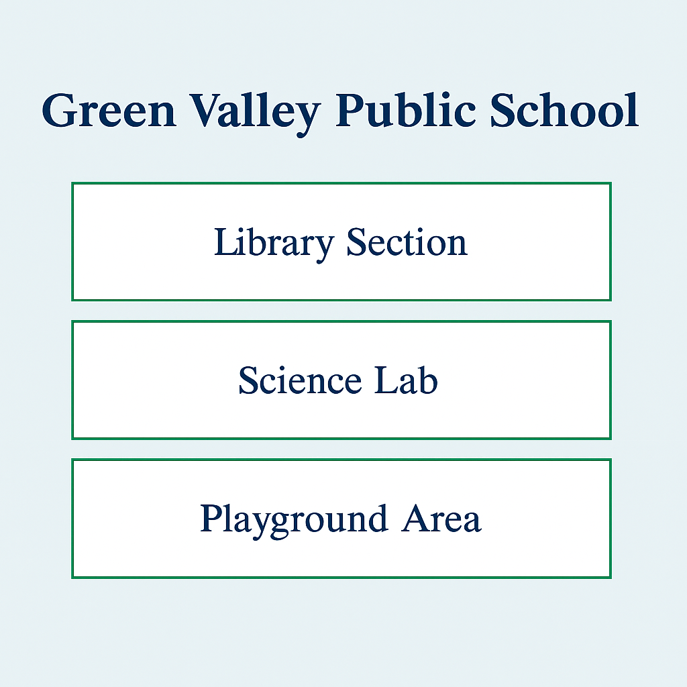

# 📘 CSS Fundamentals: Box Model, Margin, Padding, Border

## 📚 Learning Objectives
- Understand the **CSS box model**
- Apply and visualize `margin`, `padding`, `border`, and `width`
- Style content boxes and learn layout spacing techniques
- *Use CSS properties like `margin`, `padding`, `border`, `width`, `height`, and `box-sizing`*

---

## ✅ Step-by-Step Tasks

1. **Create a new folder** named `day6-school-homepage`.
2. Inside the folder, **create two files**:
   - `index.html`
   - `style.css`
3. Open `index.html` in a text editor and complete the following steps:
4. Create a complete HTML page with the standard structure.
5. Inside the `<head>` tag:
   - Add `<meta charset="UTF-8">`
   - Set `<title>` as:  
     **Green Valley Public School – Day 6**
   - Link the CSS file using a `<link>` tag: `href="style.css"`

---

### 🔹 HTML Body Content

6. Add an `<h1>` heading with the text:  
   **Green Valley Public School**

7. Add three `
` elements below it. Each `div` will represent a section:
   - The first div should contain: **"Library Section"**
   - The second div should contain: **"Science Lab"**
   - The third div should contain: **"Playground Area"**

---

### 🔹 Write the CSS in `style.css`

8. Style the `body` with:
   - `font-family: Arial, sans-serif`
   - `background-color: #eef5f9`

9. Target all `div` elements and apply the following:
   - `width: 300px`
   - `height: 100px`
   - `background-color: white`
   - `border: 2px solid #4CAF50`
   - `margin: 20px auto`
   - `padding: 20px`
   - `text-align: center`
   - `box-sizing: border-box`

10. Style the `h1` with:
   - `text-align: center`
   - `color: #003366`

---

## ✅ Final Checklist for Students

- [ ] Folder is named `day6-school-homepage`
- [ ] Contains `index.html` and `style.css`
- [ ] Three divs are created and display different section names
- [ ] Each box has border, margin, padding, and fixed width
- [ ] Boxes are centered and evenly spaced
- [ ] Page renders with correct spacing and layout

---

### 🖼️ Preview Output

*Add this image as `chapter06.png` in `../images/`:*

