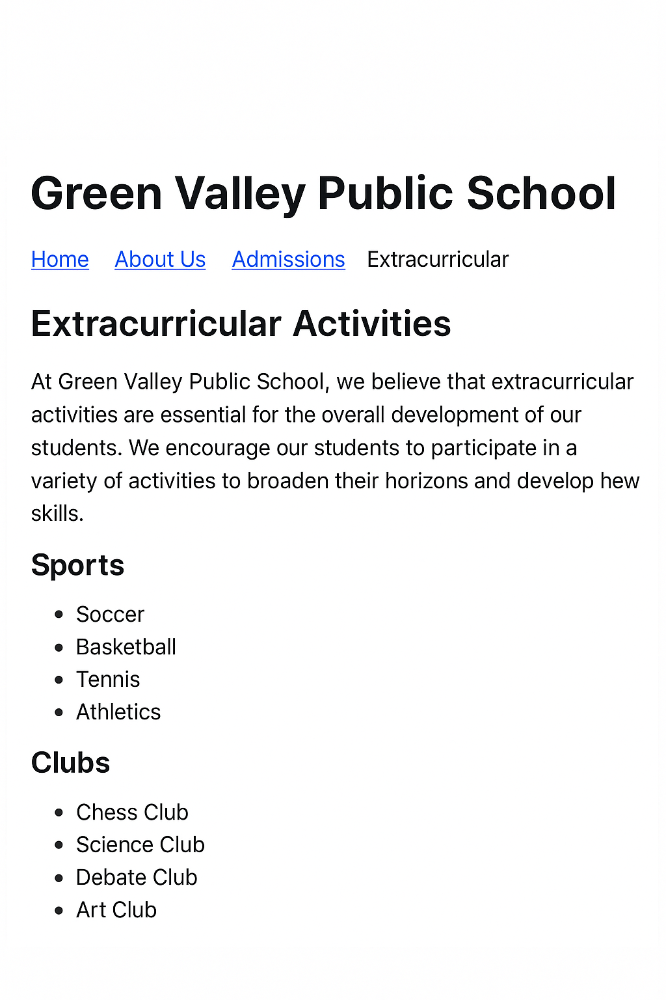

# 📘 CSS Flexbox: Basic Layout Alignment and Spacing

## 📚 Learning Objectives
- Understand the use of **Flexbox** to align and space items
- Learn how to use `display: flex`, `justify-content`, and `align-items`
- Apply Flexbox to create a **horizontal navigation bar** and **flex card layout**
- *Use properties like `flex-direction`, `gap`, `align-items`, `justify-content`, `flex-wrap`*

---

## ✅ Step-by-Step Tasks

1. **Create a new folder** named `day7-school-homepage`.
2. Inside the folder, create:
   - `index.html`
   - `style.css`
3. Open `index.html` and create a complete HTML page with the usual structure.
4. In the `<head>`, add:
   - `<meta charset="UTF-8">`
   - `<title>`:  
     **Green Valley Public School – Day 7**
   - Link the CSS file using `<link rel="stylesheet" href="style.css">`

---

### 🔹 Header Section

5. In the `<body>`, add a `<header>` element containing:
   - `<h1>`: **Green Valley Public School**

6. Below the heading, create a `<nav>` with a horizontal menu containing 4 links using a `div` or `<ul>` with:
   - Home
   - About Us
   - Admissions
   - Contact

---

### 🔹 Flex Card Layout

7. Create a `<section>` with the heading:  
   **Our School Facilities**

8. Inside that section, create a `div` with **class="facility-container"**.

9. Inside the container, create **3 divs** (cards) with class `"facility-box"`. Each box should contain:
   - An `<h3>` for section title: Library, Computer Lab, Playground
   - A `
` with 1 line about that facility

---

### 🔹 Write the CSS in `style.css`

10. General Styles:
   - Set `body` font to `Arial, sans-serif`
   - Center the `<h1>`
   - Set `margin: 0` and `padding: 0` for clean layout

11. Navigation Bar:
   - Style the nav as a horizontal Flex container
   - Use `justify-content: center`, `gap: 20px`, and `background-color: #003366`
   - Set each link’s text color to white and remove underline

12. Facilities Section:
   - Style `.facility-container` with `display: flex`, `gap: 20px`, `justify-content: center`
   - Give `.facility-box`:
     - `background-color: #f8f8f8`
     - `border: 1px solid #ccc`
     - `padding: 20px`
     - `width: 200px`
     - `text-align: center`

---

## ✅ Final Checklist for Students

- [ ] Folder: `day7-school-homepage` with `index.html` and `style.css`
- [ ] Header with school title
- [ ] Horizontal nav bar with 4 links styled with Flexbox
- [ ] Facilities section with 3 flex-aligned boxes (Library, Lab, Playground)
- [ ] Page is clean, readable, and spaced correctly

---

### 🖼️ Preview Output

*Add this image as `chapter07.png` in `../images/`:*

