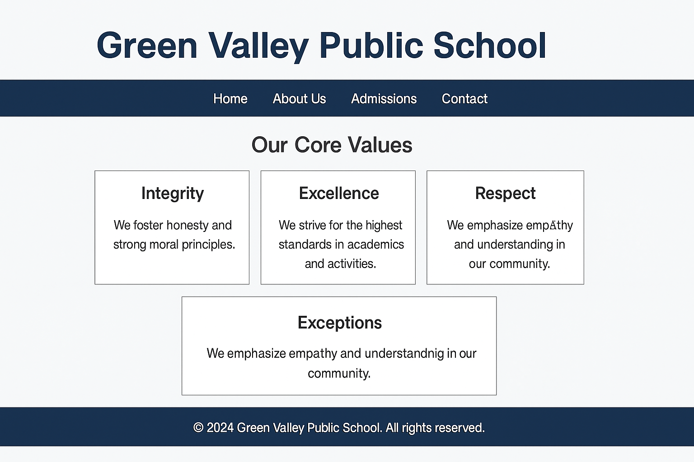

# 📘 CSS Flexbox Project: Responsive Homepage Sections

## 📚 Learning Objectives
- Apply Flexbox to organize sections of a homepage
- Use `flex-wrap`, `gap`, and `max-width` for responsive design
- Create structured sections like Principal’s Message and Notice Board
- Improve layout organization and readability

---

## ✅ Step-by-Step Tasks

1. **Create a new folder** named `day8-school-homepage`.
2. Inside the folder, create:
   - `index.html`
   - `style.css`
3. Open `index.html` and create a complete HTML page with the usual structure.
4. In the `<head>`, include:
   - `<meta charset="UTF-8">`
   - `<title>` as:  
     **Green Valley Public School – Day 8**
   - Link the CSS file using:  
     `<link rel="stylesheet" href="style.css">`

---

### 🔹 Page Content Structure

5. In the `<body>`, add a `<header>` with an `<h1>`:
   **Green Valley Public School**

6. Below it, create a section with `class="homepage-section"` and inside that, create two `div`s side by side using Flexbox:
   - **Left box (class="principal-box")**:
     - `<h2>`: Principal’s Message
     - `
`: Our school’s aim is to provide a nurturing environment where every student thrives academically and personally.
   - **Right box (class="notice-box")**:
     - `<h2>`: Notice Board
     - `<ul>` containing:
       - Parent-Teacher Meeting on 25th Sept
       - School Trip on 30th Sept
       - Science Fair on 5th Oct

---

### 🔹 CSS in `style.css`

7. General styles:
   - `body`: `font-family: Arial, sans-serif; background-color: #f0f4f8`
   - `h1`: centered with `color: #003366`
   - Add spacing to the body using `margin: 0; padding: 20px`

8. `.homepage-section`:
   - `display: flex`
   - `gap: 20px`
   - `flex-wrap: wrap`
   - `justify-content: center`
   - `max-width: 800px; margin: 0 auto`

9. `.principal-box` and `.notice-box`:
   - `background-color: #ffffff`
   - `padding: 20px`
   - `border: 1px solid #ccc`
   - `width: 350px`
   - `box-shadow: 0 2px 5px rgba(0,0,0,0.1)`

---

## ✅ Final Checklist for Students

- [ ] Folder is named `day8-school-homepage`
- [ ] Contains `index.html` and `style.css`
- [ ] Flex layout with two boxes side by side
- [ ] Principal message and notice board are clearly separated
- [ ] Responsive behavior when screen is small
- [ ] Page is visually organized and styled cleanly

---

### 🖼️ Preview Output

*Add this image as `chapter08.png` in `../images/`:*

