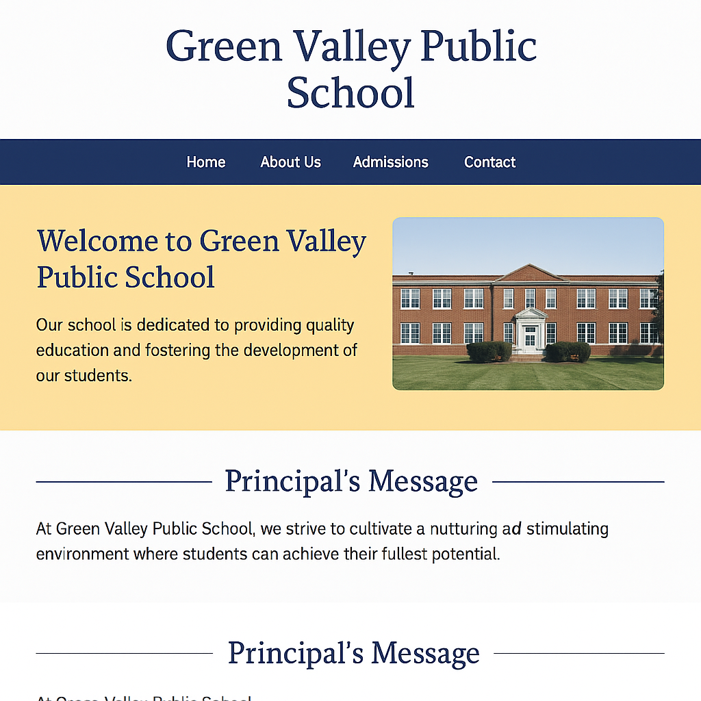

# 📘 CSS Grid: Multi-Section Page Layout

## 📚 Learning Objectives
- Learn how to use **CSS Grid** for creating responsive layouts
- Structure a page into **grid-based sections**: welcome, news, events
- Use properties like `display: grid`, `grid-template-columns`, `gap`, and `grid-area`
- Understand how Grid differs from Flexbox and when to use it

---

## ✅ Step-by-Step Tasks

1. **Create a new folder** named `day9-school-homepage`.
2. Inside the folder, create:
   - `index.html`
   - `style.css`
3. Open `index.html` and build a standard HTML page.
4. In the `<head>`, include:
   - `<meta charset="UTF-8">`
   - `<title>` as:  
     **Green Valley Public School – Day 9**
   - Link the CSS file using:  
     `<link rel="stylesheet" href="style.css">`

---

### 🔹 HTML Body Content

5. Inside the `<body>`, add a `<header>` with the following:
   - `<h1>`: **Green Valley Public School**

6. Create a `
` that will contain 3 child divs:
   - `
`
     - `<h2>`: Welcome Message
     - `
`: Welcome to our school. We are committed to excellence in education and character.
   - `
`
     - `<h2>`: Latest News
     - `<ul>`:
       - New library books added
       - Science fair registrations open
   - `
`
     - `<h2>`: Upcoming Events
     - `
`: Annual Day – 15th October

---

### 🔹 CSS in `style.css`

7. General body styling:
   - `font-family: Arial, sans-serif`
   - `margin: 0; padding: 20px; background-color: #f4f7fa`
   - `h1`: center-aligned with `color: #2a2a72`

8. Style `.grid-layout`:
   - `display: grid`
   - `grid-template-columns: 1fr 1fr 1fr`
   - `gap: 20px`
   - `max-width: 1000px`
   - `margin: 20px auto`

9. Style all inner boxes (`.welcome`, `.news`, `.events`):
   - `background-color: white`
   - `padding: 20px`
   - `border: 1px solid #ccc`
   - `box-shadow: 0 2px 4px rgba(0,0,0,0.1)`
   - `border-radius: 8px`

---

## ✅ Final Checklist for Students

- [ ] Folder is named `day9-school-homepage`
- [ ] Page includes 3 grid-aligned sections: welcome, news, events
- [ ] CSS Grid is used for layout
- [ ] Visual spacing, clean boxes, and center alignment are correct
- [ ] Responsive behavior when screen shrinks (stacking allowed)

---

### 🖼️ Preview Output

*Add this image as `chapter09.png` in `../images/`:*

